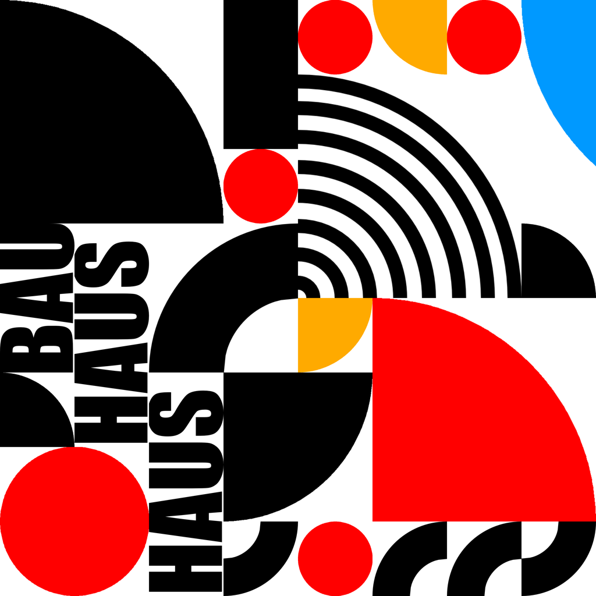

# bau - a random Bauhaus art generator

This is a simple Python script to output stuff like this:

## Why?

Because.

## Prerequisites

* Python 2 or 3
* [PILLOW](https://pillow.readthedocs.io/)

## Image sets

You can use custom image sets to feed the generator. Just make sure your images are in one of these aspect ratios: 1:1, 1:2 or 1:3. Initializing the Bau class with imageset="your_custom_imageset" will look up all .png and .jpg files under the your_custom_imageset folder and use them.
